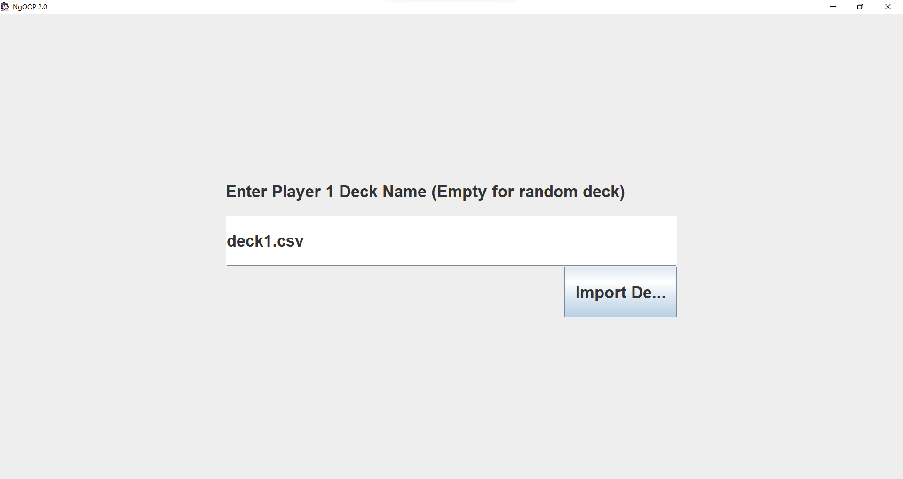
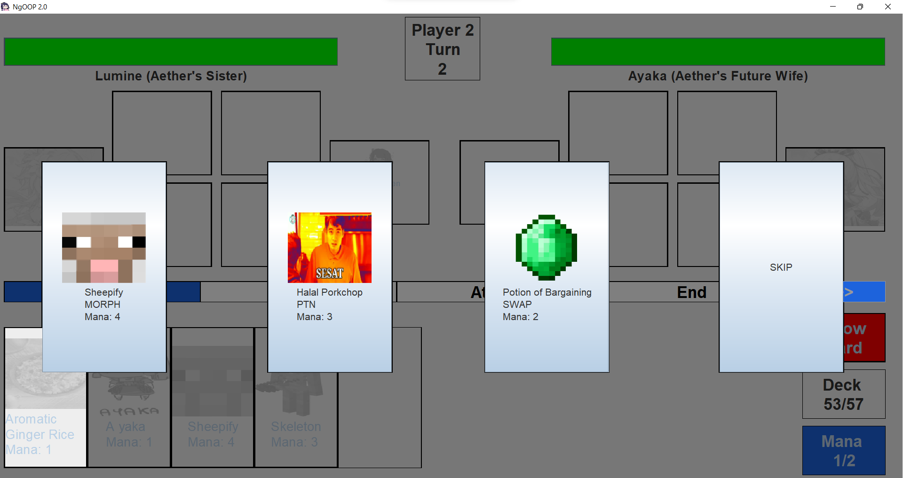
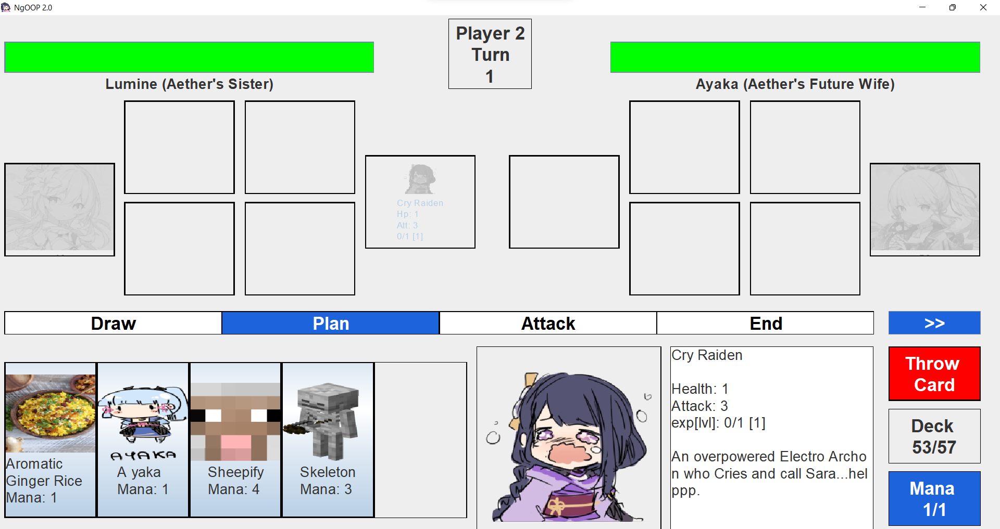
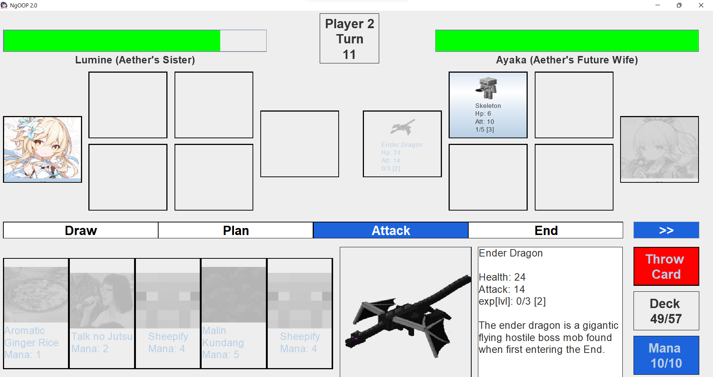
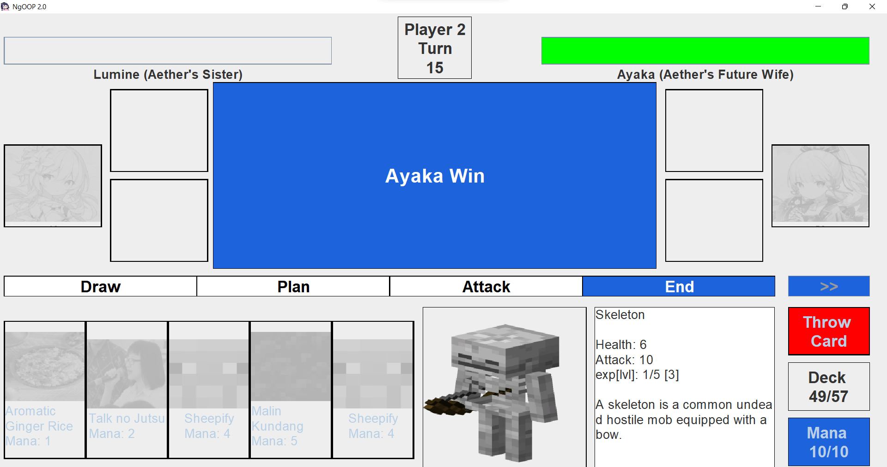

# IF2210 Major Assignment 2


## Authors
```java
import java.util.ArrayList;

ArrayList<String> members=[
        "13520019 Maharani Ayu Putri Irawan",
        "13520034 Bryan Bernigen",
        "13520040 Ng Kyle",
        "13520088 Rio Alexander Audino",
        "13520115 Maria Khelli"
        ];

System.out.println("Created by: ");
for (String member : members){
        System.out.println("- "+member);
}
```

## How to Compile
Bergantung pada Text Editor yang Anda gunakan, beberapa cara <i>compile</i> berikut dapat digunakan:
1. VS Code <br/>
Dapat ditekan button ```Run``` pada ```main```
2. Intellij IDEA <br/>
Dapat dilakukan dengan menekan button ```Compile and run``` pada menu bar
3. Terminal (secara umum) <br/>
Masukkan command berikut,
```./gradlew run``` pada root directory.

## Program Structure

``` java

|   
+---main
|   +---java
|   |   \---com
|   |       \---aetherwars
|   |           |   AetherWars.java
|   |           |   
|   |           +---card
|   |           |       
|   |           +---exceptions
|   |           |       
|   |           +---GUI
|   |           |       
|   |           +---model
|   |           |       
|   |           \---util
|   |                   
|   \---resources
|       \---com
|           \---aetherwars
|               |   
|               \---card
|                   +---data
|                   |       
|                   +---deck
|                   |       
|                   \---image
|                       |   
|                       +---character
|                       |       
|                       \---spell
|                           +---immune
|                           |       
|                           +---morph
|                           |       
|                           +---potion
|                           |       
|                           \---swap
|                                   
\---test
    \---java
        +---card
        |       
        +---model
        |       
        \---utils
```

## Code Structure

Pada struktur folder, dapat dilihat bahwa ada folder main dan test. Folder main berisi kelas-kelas implementasi dari program kami, sedangkan folder test merupakan unit testing yang diimplementasikan dengan JUnit. 

- Package com.aetherwars berisi implementasi utama dengan main driver pada file ```Aetherwars.java```.

- Pada package ```com.aetherwars.card``` berisi implementasi kelas dari card yaitu kartu yang digunakan dalam permainan ini.

- Pada package ```com.aetherwars.exceptions``` berisi kelas exceptions buatan yang diturunkan dari kelas exceptions java.

- Pada package ```com.aetherwars.GUI``` berisi kelas implementasi GUI aplikasi.

- Pada package ```com.aetherwars.model``` berisi kelas model yang digunakan pada aplikasi, termasuk di antaranya kelas Player, container Deck dan Board.

- Pada package ```com.aetherwars.util``` berisi kelas utility yang berfungsi untuk melakukan pembacaan konfigurasi dan utility lainnya.

- Seluruh resource (konfigurasi, gambar, dan data csv) berada pada folder ```main/resources```.<br>
  - Untuk menambahkan kartu baru, ubahlah salah satu csv file pada ```resources/com/aetherwars/card/data``` sesuai dengan tipe kartu yang akan ditambahkan. <br>
  - Untuk menambahkan gambar untuk kartu tambahkan pada ```resources/com/aetherwars/card/image```<br>
  - Untuk menambahkan deck custom, tambahkan csv file pada ```resources/com/aetherwars/card/deck```

## How to run

### **In IntelliJ:**
1. Make sure you have Gradle installed.
2. On the top right corner, click ```Gradle```.
3. Open Task > application.
4. Right click on ```run```, then click "Run 'project name' [run]"

Note: ```main``` is in src\main\java\AetherWars. Hence, if you want to run the app, you can also do it from there. (See the small green triangle in the left side)


## Screenshoot

1. Deck

<table>
    <tr>
      <td><a>Nama Modul</a></td>
      <td>Screen Capture</td>
    </tr>
    <tr>
      <td><a>Deck</a></td>
      <td>  </td>
    </tr>
    <tr>
      <td><a>Draw</a></td>
      <td> </td>
    </tr>
    <tr>
      <td><a>Play</a></td>
      <td> </td>
    </tr>
    <tr>
      <td><a>Attack</a></td>
      <td> </td>
    </tr>
    <tr>
      <td><a>End Game</a></td>
      <td> </td>
    </tr>
</table>


